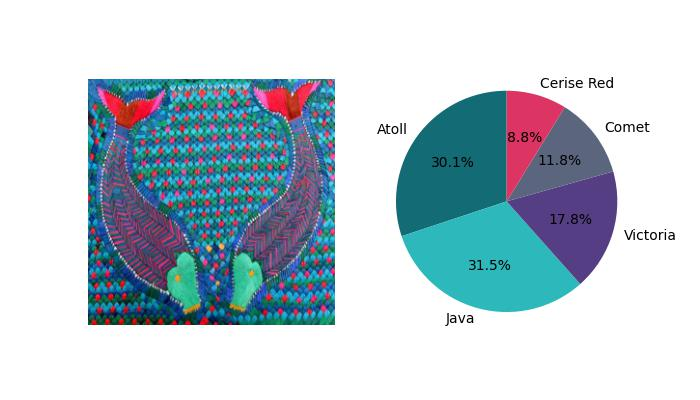
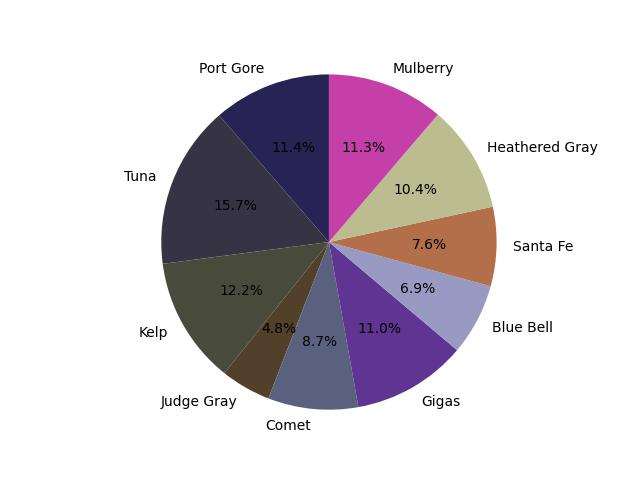

介绍
---------
本项目为用于分析苗绣主题色

安装
----------
```
git clone https://github.com/zhongjiuhuan/miaoxiu.git
```
```
pip install -r requirement.txt
```
使用方法
----------
```
python 苗绣主题色提取.py --folder_path <你需要计算的图片所在目录> --project_name <自定义项目名称> --plt_save_dir <结果图片的保存地址>
```
效果图
--------
* 第一次聚类


* 第二次聚类



参考
-------
https://github.com/nandinib1999/DominantColors